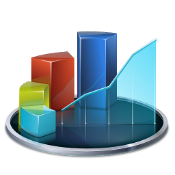
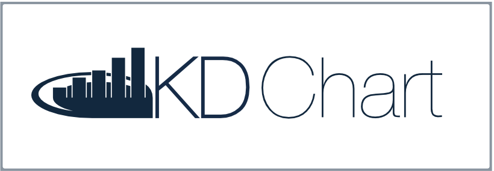

# Introduction

KD Chart is a tool for creating business and scientific charts.
It provides developers with a sophisticated way to customize layouts
and to design and manage large numbers of axes.  Since all configuration
settings have practical defaults, you can usually get by with tweaking
just a few parameters and then relying on the defaults for the rest.

KD Chart targets C++ programmers who use Qt in their applications.

For more information, see <https://www.kdab.com/development-resources/qt-tools/kd-chart>

Try KD Chart in your web browser! visit <https://demos.kdab.com/wasm/kdchart>

## Using KD Chart

KD Chart requires Qt5.15.0 or newer, and a compiler with C++11 support.
Qt6 support is added starting with KD Chart version 3.0, and requires
a compiler with C++17 support.

See [INSTALL.txt](INSTALL.txt) for installation instructions using CMake.

After reading the introductory overview files in docs/
you will find more information at these places:

* [detailed browsable API reference](https://kdab.github.io/KDChart)
* [programmers manual with examples](docs/manual/kdchart.pdf)
* [our sorted example programs](examples/)

## Contact

* See our official home page: <https://www.kdab.com/development-resources/qt-tools/kd-chart>
* Visit us on GitHub: <https://github.com/KDAB/KDChart>
* Email info@kdab.com for questions about this product.

Stay up-to-date with KDAB product announcements:

* [KDAB Newsletter](https://news.kdab.com)
* [KDAB Blogs](https://www.kdab.com/category/blogs)
* [KDAB on Twitter](https://twitter.com/KDABQt)

## Get Involved

KDAB will happily accept external contributions.

Please submit your contributions or issue reports to our GitHub space at
<https://github.com/KDAB/KDChart>.

## License

The KD Chart Software is © Klarälvdalens Datakonsult AB (KDAB), and is
available under the terms of the [MIT](LICENSES/MIT.txt) license.

Contact KDAB at <info@kdab.com> for any licensing queries.

## About KDAB

KD Chart is supported and maintained by Klarälvdalens Datakonsult AB (KDAB).

The [KDAB](https://www.kdab.com) Group is a globally recognized provider for software consulting, development and training, specializing in embedded devices and complex cross-platform desktop applications. In addition to being leading experts in Qt, C++ and 3D technologies for over two decades, KDAB provides deep expertise across the stack, including Linux, Rust and modern UI frameworks. With 100+ employees from 20 countries and offices in Sweden, Germany, USA, France and UK, KDAB serves clients around the world.

Please visit <https://www.kdab.com> to meet the people who write code like this.

Blogs and publications: https://www.kdab.com/resources

Videos (Tutorials and more): https://www.youtube.com/@KDABtv

Software Developer Training for Qt, Modern C++, Rust, OpenGL and more: https://training.kdab.com  

Software Consulting and Development Services for Embedded and Desktop Applications https://www.kdab.com/services/

KD CHART and the KD CHART logo are registered trademarks of Klaralvdalens Datakonsult AB
in the European Union, the United States, and/or other countries.  Other product and
company names and logos may be trademarks or registered trademarks of their respective companies.
